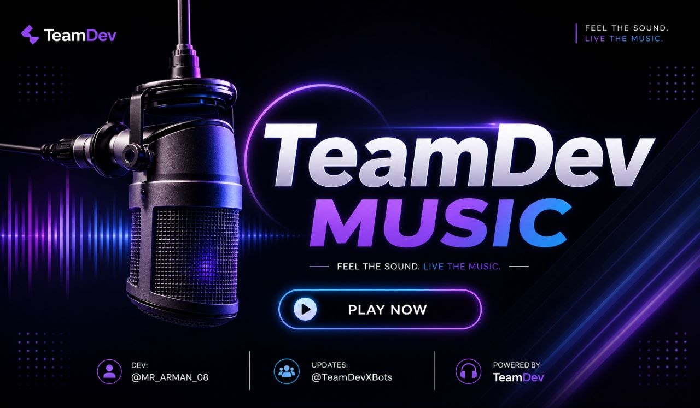
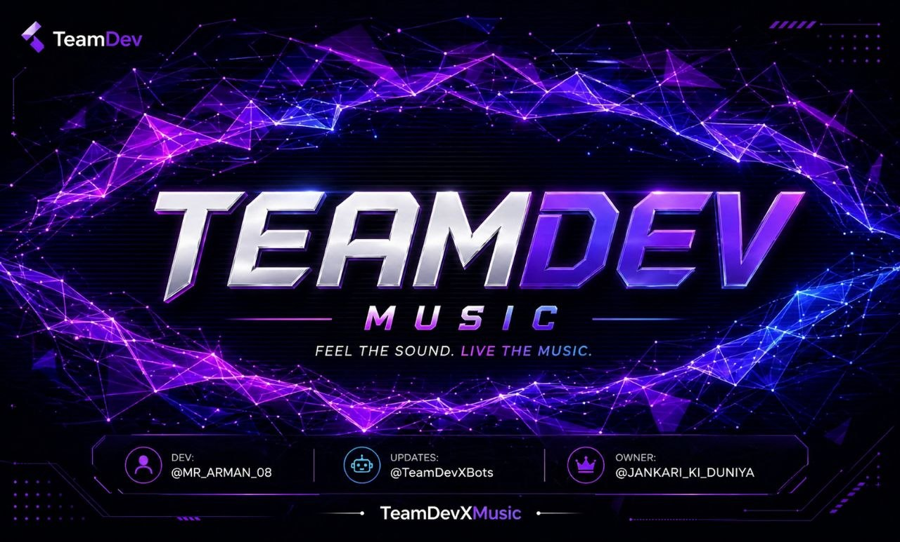

<div align="center">



# TeamDevXMusic

**The Most Powerful & Feature-Rich Telegram Music Bot**  
*Stream music & videos in Telegram Voice Chats — with style.*

[](https://python.org)
[](https://pyrogram.org)
[](LICENSE)
[](https://core.telegram.org/bots/api)
[](https://t.me/TeamDevXBots)

<br/>

[](https://t.me/Team_X_Og)
[](https://t.me/TeamDevXBots)
[](https://t.me/MR_ARMAN_08)

---

> *Fast · Stable · Feature-Packed · Maintained with care by [TeamDev](https://t.me/Team_X_Og)*

</div>

---

## Features

### Audio & Video

<table>
<tr>
<td align="center" width="33%">


High-quality audio streaming in Voice Chats with queue management, loop/repeat, shuffle, volume control and inline playback buttons.

</td>
<td align="center" width="33%">


Crystal-clear video streaming with Picture-in-Picture support, live stream compatibility, seek/skip, and full VC playback controls.

</td>
<td align="center" width="33%">


YouTube · Spotify (Track/Playlist/Album/Artist) · SoundCloud · Apple Music · Resso · Direct URL/File

</td>
</tr>
</table>

---

### Autoplay — Uninterrupted Music

> One of the most powerful features of TeamDevXMusic.

When the queue ends, **Autoplay** automatically fetches and streams songs related to the **first track played** by a user — keeping the Voice Chat alive without any manual intervention. No awkward silences, no need to queue up the next song. The bot carries on seamlessly, using that initial track as the seed for what plays next.

Enable or disable it anytime via `/settings` or the inline settings panel.

---

### Admin & Control

| Control | Description |
|---------|-------------|
| Auth System | Grant non-admins access to music controls |
| Pause / Resume / Stop / Skip | Full playback control from chat |
| Mute / Unmute | Silence the bot in voice chat without stopping stream |
| Seek | Jump forward or backward by any number of seconds |
| Loop | Repeat 1–10 times or toggle infinite looping |
| Shuffle | Instantly randomize the current queue |

---

### Multi-Language Support

Supports **8+ languages** out of the box:

`English` · `Hindi` · `Gujarati` · `French` · `Azerbaijani` · `Turkish` · `Sinhala` · `Cheems`

---

### Multi-Assistant Support

Run up to **5 userbot sessions** in parallel — ensuring maximum availability even in the busiest groups.

---

### Extras & Utility Modules

Background Remover · Dice Games · Domain Lookup & IP Info · Anime Search · Password Generator · Group Stats · Figlet Text Art · Fun Tag Messages · Greet Detector · Movie Info · PyPI Package Lookup · QR Code Generator · Love Calculator · Meme Fetcher · and more

---

## Quick Start

### Prerequisites

| Requirement | Source |
|-------------|--------|
| Python 3.10+ | [python.org](https://python.org) |
| Telegram API ID & Hash | [my.telegram.org](https://my.telegram.org) |
| Bot Token | [@BotFather](https://t.me/BotFather) |
| MongoDB URI | [mongodb.com](https://mongodb.com) |
| Pyrogram String Session | [@StringFatherBot](https://t.me/StringFatherBot) |

### Installation

```bash
# 1. Clone the repository
git clone https://github.com/justfortestingnothibghere/TeamDevXMusic
cd TeamDevXMusic

# 2. Install dependencies
pip install -r requirements.txt

# 3. Configure environment variables
cp .env.bak .env
nano .env

# 4. Start the bot
python -m TeamDevXMusic
```

---

## Configuration Variables

> Create a `.env` file in the root directory and fill in the values below.

### Required Variables

| Variable | Description |
|----------|-------------|
| `API_ID` | Telegram API ID from [my.telegram.org](https://my.telegram.org) |
| `API_HASH` | Telegram API Hash from [my.telegram.org](https://my.telegram.org) |
| `BOT_TOKEN` | Bot token obtained from [@BotFather](https://t.me/BotFather) |
| `OWNER_ID` | Your Telegram numeric user ID |
| `MONGO_DB_URI` | MongoDB connection string (Atlas recommended) |
| `LOG_GROUP_ID` | Telegram Group ID used for bot logs |
| `MUSIC_BOT_NAME` | Display name for your bot |
| `STRING_SESSION` | Pyrogram string session for assistant account 1 |

### Optional Variables

| Variable | Default | Description |
|----------|---------|-------------|
| `STRING_SESSION2` – `STRING_SESSION5` | — | Additional assistant accounts (up to 5 total) |
| `DURATION_LIMIT` | `900` | Max song duration in seconds |
| `SONG_DOWNLOAD_DURATION_LIMIT` | `180` | Max downloadable song duration in seconds |
| `SPOTIFY_CLIENT_ID` | — | Spotify API Client ID |
| `SPOTIFY_CLIENT_SECRET` | — | Spotify API Client Secret |
| `GENIUS_API_TOKEN` | — | Genius API token for lyrics |
| `SUPPORT_GROUP` | — | Your support group link |
| `UPDATES_CHANNEL` | — | Your updates channel link |

---

### Cookies — Do Not Touch

> **WARNING: Leave the `cookies/` folder and any cookie-related config exactly as they are. Do not modify anything inside it.**

The `cookies/` directory contains pre-configured `yt-dlp` session cookies required for age-restricted and region-locked content on YouTube and other platforms. These are set up by the developer and work out of the box.

**Do not modify, replace, delete, or add any files inside this folder.** Tampering with cookies will break playback and may result in your IP being rate-limited or temporarily banned by the platform.

```
cookies/
  └── cookies.txt    <-- Do NOT edit, replace, or delete. Leave as default.
```

> If you are facing playback issues, do **not** touch the cookies. Contact support at [@SECRECT_BOT_UPDATES](https://t.me/Team_X_Og) instead.

---

## Docker Deployment

```bash
# Recommended: Docker Compose
docker-compose up -d

# Manual build
docker build -t teamdevxmusic .
docker run -d --env-file .env teamdevxmusic
```

---

## Cloud Deployment

| Platform | Status | Notes |
|----------|--------|-------|
| Railway | Supported | Use `render.yaml` |
| Render | Supported | Use `render.yaml` |
| Heroku | Supported | `Procfile` + `heroku.yml` |
| Docker | Supported | `Dockerfile` included |

```bash
# Heroku
heroku create your-bot-name
git push heroku main

# Railway / Render
# Connect your GitHub repo and set env variables in the platform dashboard.
```

---

## Project Structure

```
TeamDevXMusic/
├── TeamDevXMusic/             # Core bot package
│   ├── modules/               # All feature modules
│   │   ├── admins/            # VC control commands (skip, seek, loop...)
│   │   ├── bot/               # Start, help, settings, inline
│   │   ├── devs/              # Developer-only commands
│   │   ├── extras/            # Fun & utility modules
│   │   └── addons/            # Welcome, broadcast, punishment...
│   └── toolkit/               # Internal engine
│       ├── engine/            # Streamer & queue management
│       ├── datastore/         # MongoDB & in-memory DB
│       ├── guards/            # Permission checks
│       └── panels/            # UI message builders
├── assets/                    # Thumbnails & fonts
├── Backgrounds/               # Custom playback backgrounds
├── config/                    # Configuration loader
├── strings/                   # Multi-language YAML files
│   └── langs/                 # en, hi, gu, fr, az, tr, si...
├── cookies/                   # yt-dlp cookies (DO NOT MODIFY)
├── .env                       # Environment variables
├── requirements.txt           # Python dependencies
├── Dockerfile                 # Docker config
└── launch.py                  # Entry point
```

---

## Preview

<div align="center">

| Mode | Preview |
|------|---------|
| Audio Mode |  |
| Video Mode |  |
| Global Stats |  |
| Spotify Album |  |
| Spotify Artist |  |
| Ping |  |

</div>

---

## Commands Reference

### Playback

| Command | Description |
|---------|-------------|
| `/play [song/url]` | Play audio in voice chat |
| `/vplay [song/url]` | Play video in voice chat |
| `/pause` | Pause current stream |
| `/resume` | Resume paused stream |
| `/stop` | Stop and leave voice chat |
| `/skip` | Skip to next track |
| `/queue` | View current queue |
| `/loop [1-10/enable/disable]` | Toggle loop mode |
| `/shuffle` | Shuffle the queue |
| `/seek [seconds]` | Seek forward |
| `/seekback [seconds]` | Seek backward |
| `/mute` | Mute the bot |
| `/unmute` | Unmute the bot |

### Sources

| Command | Description |
|---------|-------------|
| `/play spotify:[link]` | Play from Spotify |
| `/play soundcloud:[link]` | Play from SoundCloud |
| `/play [youtube url]` | Play from YouTube |

### Admin

| Command | Description |
|---------|-------------|
| `/auth [user]` | Authorize a user for VC controls |
| `/unauth [user]` | Remove user authorization |
| `/authlist` | View all authorized users |
| `/settings` | Open bot settings panel |
| `/playmode` | Toggle play mode (group/channel) |
| `/reload` | Reload admin cache |
| `/admincache` | Refresh admin list |

---

## Requirements

```
pyrogram · ntgcalls · py-tgcalls · yt-dlp · spotipy
motor · pillow · aiohttp · aiofiles · uvloop
lyricsgenius · beautifulsoup4 · PyYAML · httpx · qrcode
python-whois · pyfiglet · gpytranslate · Flask · gunicorn
```

```bash
pip install -r requirements.txt
```

---

## Support & Community

<div align="center">

| Platform | Link |
|----------|------|
| Support Group | [@SECRECT_BOT_UPDATES](https://t.me/Team_X_Og) |
| Updates Channel | [@TeamDevXBots](https://t.me/TeamDevXBots) |
| Developer | [@MR_ARMAN_08](https://t.me/MR_ARMAN_08) |

</div>

---

## License & Credits

This project is licensed under the **GNU General Public License v3.0** — see the [LICENSE](LICENSE) file for details.

**Developer & Maintainer:** [Arman](https://t.me/MR_ARMAN_08) ([@MR_ARMAN_08](https://t.me/MR_ARMAN_08))  
**Team:** [TeamDev](https://t.me/Team_X_Og)

> This project is part of [@SECRECT_BOT_UPDATES](https://t.me/Team_X_Og)'s ecosystem.
> Do **not** redistribute or resell this project as your own.  
> Unauthorized usage will result in action by TeamDev.

---

<div align="center">

**Compatible with BotAPI 9.5 · Built for BotAPI 9.5**

If you find this useful, star the repo — we push updates when we hit 30+ stars in a month.

<br/>

Made with care by [TeamDev](https://t.me/Team_X_Og) · Copyright &copy; 2026 TeamDevXBot

</div>
